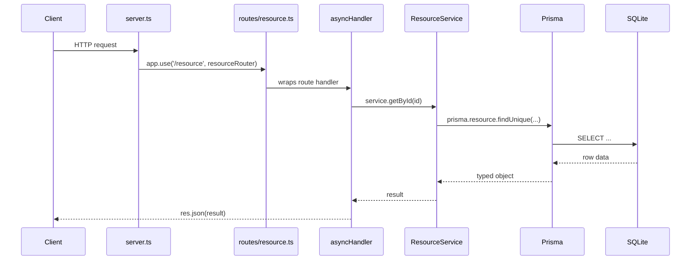
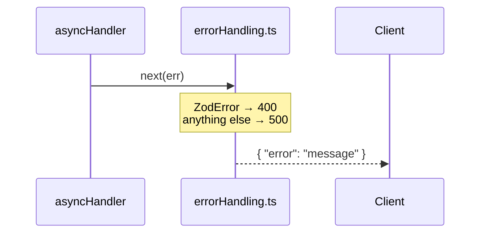

# Allegro

A lightweight REST API framework built on Node.js, Express.js, Prisma, and TypeScript. Allegro provides the structure and conventions for building data-driven APIs — routing, validation, error handling, and database access — without dictating what your domain looks like.

This repository includes a **veterinary practice example** (treatments, vets, appointment types) to demonstrate how the framework patterns fit together in a real implementation. The example is not the framework itself.

## Quick Start

### Prerequisites

- Node.js 24
- npm

### Installation

```bash
npm install
npm run prisma:generate

# Set up the database
npm run prisma:migrate
npm run prisma:seed     # Seed with the veterinary practice data from data.ts

npm run dev
```

The API will be available at <http://localhost:4000>.

### Build for Production

```bash
npm run build
npm start
```

---

## Project Structure

```
src/
├── server.ts              # App setup: middleware, route mounting, error handler
├── generated/
│   └── prisma/            # Generated Prisma client (do not edit)
├── lib/
│   └── prisma.ts          # Shared Prisma client (SQLite adapter)
├── middleware/
│   └── errorHandling.ts   # asyncHandler wrapper + central error handler
├── routes/                # One file per resource, mounted in server.ts
│   ├── treatments.ts
│   ├── vets.ts
│   └── appointmentTypes.ts
├── services/              # Business logic (all Prisma interactions)
│   ├── TreatmentService.ts
│   ├── VetService.ts
│   └── AppointmentTypeService.ts
├── types/
│   └── index.ts           # TypeScript interfaces
└── validation/
    └── schemas.ts         # Zod validation schemas

prisma/
├── schema.prisma          # Prisma data model
└── seed.ts                # Database seed script

data.ts                    # Sample data used by the seed script
prisma.config.ts           # Prisma 7 configuration
```

---

## Adding a New Route

Every route follows the same four-file pattern: schema → service → router → mount.

### Request flow



### Error flow

When anything throws — a Zod parse failure, a service error, or a Prisma exception — `asyncHandler` forwards it to the central error handler without any per-route try/catch.



### Step-by-step

**1. Add a Zod schema** in `src/validation/schemas.ts`:

```ts
export const createExampleResourceInputSchema = z.object({
  name: z.string().min(1),
});
```

**2. Add a service class** in `src/services/ExampleResourceService.ts`:

```ts
import { prisma } from '../lib/prisma';

export class ExampleResourceService {
  async getAllExampleResources() {
    return prisma.exampleResource.findMany();
  }

  async createExampleResource(input: { name: string }) {
    return prisma.exampleResource.create({ data: input });
  }
}

export const exampleResourceService = new ExampleResourceService();
```

Export it from `src/services/index.ts`:

```ts
export { exampleResourceService } from './ExampleResourceService';
```

**3. Create the route file** at `src/routes/exampleResources.ts`:

```ts
import { Router } from 'express';
import { exampleResourceService } from '../services';
import { createExampleResourceInputSchema } from '../validation/schemas';
import { asyncHandler } from '../middleware/errorHandling';

export const exampleResourcesRouter = Router();

exampleResourcesRouter.get('/', asyncHandler(async (_req, res) => {
  res.json(await exampleResourceService.getAllExampleResources());
}));

exampleResourcesRouter.post('/', asyncHandler(async (req, res) => {
  const input = createExampleResourceInputSchema.parse(req.body);
  res.status(201).json(await exampleResourceService.createExampleResource(input));
}));
```

**4. Mount it** in `src/server.ts`:

```ts
import { exampleResourcesRouter } from './routes/exampleResources';

app.use('/exampleResources', exampleResourcesRouter);
```

That's it — validation errors, service errors, and database errors are all handled automatically by `errorHandling.ts`.

---

## API Reference

Base URL: `http://localhost:4000`

### Treatments

| Method | Path | Description |
| --- | --- | --- |
| GET | `/treatments` | List all treatments |
| GET | `/treatments/:id` | Get a treatment |
| POST | `/treatments` | Create a treatment |
| PUT | `/treatments/:id` | Update a treatment |
| DELETE | `/treatments/:id` | Delete a treatment |

**Create / Update body:**

```json
{
  "icon": "💉",
  "title": "Vaccinations",
  "description": "Core and booster vaccinations.",
  "duration": "15 min"
}
```

### Vets

| Method | Path | Description |
| --- | --- | --- |
| GET | `/vets` | List all vets |
| GET | `/vets/:id` | Get a vet |
| POST | `/vets` | Create a vet |
| PUT | `/vets/:id` | Update a vet |
| DELETE | `/vets/:id` | Delete a vet |

**Create / Update body:**

```json
{
  "name": "Dr. Robin Smits",
  "role": "Veterinarian",
  "bio": "Focuses on general medicine and surgery.",
  "initials": "RS"
}
```

### Appointment types

| Method | Path | Description |
| --- | --- | --- |
| GET | `/appointment-types` | List all appointment types |
| GET | `/appointment-types/:id` | Get an appointment type |
| POST | `/appointment-types` | Create an appointment type |
| PUT | `/appointment-types/:id` | Update an appointment type |
| DELETE | `/appointment-types/:id` | Delete an appointment type |

**Create / Update body:**

```json
{ "slug": "vaccination", "label": "Vaccination", "durationMinutes": 15 }
```

### Health

```
GET /health
```

---

## Error Responses

All errors return JSON with an `error` field:

```json
{ "error": "Vet not found" }
```

| Status | Meaning |
| --- | --- |
| 400 | Validation error |
| 404 | Resource not found |
| 500 | Server / database error |

---

## Validation Rules

On create every field is required; on update every field is optional.

### Treatments

- `icon`, `title`, `description`, `duration` — strings, min 1 character

### Vets

- `name`, `role`, `bio`, `initials` — strings, min 1 character

### Appointment types

- `slug` — string, min 1 character, must be unique
- `label` — string, min 1 character
- `durationMinutes` — integer, at least 1

---

## Available Scripts

```bash
npm run dev              # Start dev server with hot reload
npm run build            # Compile TypeScript
npm start                # Run compiled build

npm run prisma:migrate   # Run database migrations
npm run prisma:seed      # Seed sample data
npm run prisma:studio    # Open Prisma Studio GUI
npm run type-check       # TypeScript check without building
```

---

## Environment Variables

```env
DATABASE_URL="file:./database.sqlite"
PORT=4000
NODE_ENV=development
```

---

## Dependencies

### Production

- **express** — web framework
- **@prisma/client** (v7) — database ORM
- **@prisma/adapter-better-sqlite3** — SQLite driver for Prisma 7
- **better-sqlite3** — SQLite native driver
- **zod** — runtime validation
- **cors** — CORS middleware

### Development

- **prisma** (v7) — CLI for migrations and codegen
- **typescript**, **ts-node-dev** — TypeScript tooling

---

## Sample Data

The seed script reads `data.ts` (the same content the Svelte frontend uses) and fills the database with:

- **6 Treatments**: Vaccinations, General check-up, New puppy / kitten consult, Skin & allergy consult, Lab diagnostics, Exotic animal consult
- **4 Vets**: Dr. Alex van Dijk, Dr. Robin Smits, Dr. Farah El Amrani, Dr. Michael de Groot
- **5 Appointment types**: Vaccination, General check-up, New puppy / kitten consult, Skin or allergy issue, Follow-up visit

---

## Security Notes

- Input validated with Zod before reaching the database
- Prisma uses parameterized queries (SQL injection safe)
- CORS enabled for local development

---

## License

MIT
